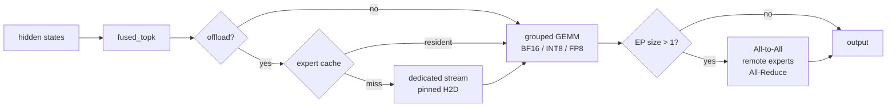

> 上一篇给 Mini-SGLang 做了分层 KV Cache，这一篇接着补 MoE。同样是一边实现一边记录，重点放在「怎么让一个 30B 的专家模型在 12GB 的 RTX 5070 上真的跑起来」。

## MoE 省的是算力，不是显存

上一篇关注的是 KV 复用，这一篇关注 FFN。dense 模型每个 token 都要过完整的 FFN；MoE 把 FFN 拆成很多个专家，每个 token 只走 top-k 个。计算量因此降到激活参数量的量级，但代价是：**显存里必须放下所有专家**。

Qwen3-30B-A3B 就是典型：总参数约 30.2B，激活参数只有 3.3B。BF16 下权重约 60GB，12GB 的 5070 根本放不下。所以「MoE 比 dense 省显存」这个说法是错的，它省的是算力。

main 分支上的 mini-sglang 其实已经有 fused MoE：`fused_topk` + `moe_align_block_size` + `fused_moe_kernel`，和 vLLM / SGLang 是同一套 kernel 血缘。但它只有一条基础路径——BF16 全驻留、单卡、无量化、无 Expert Parallel、无 CPU offload。在 12GB 卡上，这条路径连模型都装不进去。

`moe` 分支做的事，就是在保持默认行为完全不变的前提下，把同一条 fused kernel 扩展成在「小显存单卡 / 多卡 / 低精度」这些真实约束下都能跑：

- 单卡：workspace 复用、小 M 直算 kernel、grouped GEMM 的 tile 调优；
- 精度：专家权重 FP8 / INT8 量化，FP8 走原生 Tensor Core；
- 多卡：Expert Parallel + All-to-All overlap；
- 小显存：专家权重留 host，GPU 侧只放一个每层的 LRU，H2D 和计算 overlap。

所有会改变数值或权重放置的选项都是显式 opt-in，默认还是原来的单卡 BF16 路径。下面按这条线拆开讲。

一次 MoE forward 的路径大致是：



## 单卡：先把 workspace 和 kernel 选对

### workspace 复用

MoE 每次 forward 都要一批临时 tensor：top-k 权重/索引、expert 对齐用的 `sorted_ids` / `expert_ids`、两段 intermediate activation、FP8 量化的输入和 scale。这些如果每层现分配，会反复触发 allocator。

所以这里有一个 grow-only 的 `FusedMoeWorkspace`，按 shape 缓存，容量取 token 数的 2 的幂；被替换掉的旧 allocation 不释放，因为已经捕获的 CUDA Graph 可能还指着旧地址。文档里一次 RTX 5070 的测试，6 种 token 规模的总分配次数从 2100 降到 6。

### decode 的小 M 直算

decode 时 M 很小（通常 1），grouped 路径要先按专家排序、再按 `BLOCK_SIZE_M` 对齐 padding，这些固定开销占比很高。所以另写了一个 decode 向的 `direct_moe_gemv_kernel`：按 `(route, N-block)` 起 grid，直接用 `topk_ids` 查专家权重做 GEMV，不排序、不 padding。

它不是永远更快，所以默认不启用（`--moe-small-m-threshold 0`）。`--moe-autotune` 会在每个 shape + M 的 2 的幂分桶上只测一次，比较 direct 和几组 grouped config，故意用**真实的 route id** 来测，这样选出来的 kernel 是对着实际 route 倾斜标定的。direct 要赢 5% 才会被选中。

### FP8：专家权重直接减半

`--moe-expert-quantization fp8` 把专家权重存成 E4M3，配 per-output-channel 的 FP32 scale。grouped 路径上，每个激活矩阵先用一个 Triton kernel 按行动态量化，然后 FP8×FP8 的 `tl.dot` 用 FP32 累加，最后把输入和权重两个 scale 乘回去。

这里和 INT8 路径的关键区别是：INT8 是 weight-only，kernel 里先把权重反量化回 BF16 再 `tl.dot`；FP8 是真正的 FP8 Tensor Core 计算。M=1 时后端会改走 decode 向的 FP8 直算 kernel，避开激活量化和占不满的 Tensor Core。

按设计文档里 RTX 5070 的合成层测试，hybrid FP8 在 M=1/16/64/256 的中位数是 `202us / 727us / 1.16ms / 1.30ms`，BF16 是 `201us / 1.23ms / 2.02ms / 2.14ms`：M=1 基本打平，M≥16 快约 1.65–1.74x。

`--moe-expert-quantization int8` 是对称 per-output-channel 的 weight-only 路径，留作兼容。

## 继续调优：把 K-tile 打开

上面那套做完之后，我用 profiler 看了一眼合成 benchmark，发现待优化的地方非常集中：

```
M=16:  fused_moe_kernel  97.09%  GPU time
M=64:  fused_moe_kernel  97.74%
M=256: fused_moe_kernel  96.35%
```

也就是说 M≥16 时，时间几乎全在那两个 grouped GEMM 里。于是我针对 grouped GEMM 做了一次 tile 配置的扫描，`BLOCK_SIZE_M × N × K × GROUP_SIZE_M` 全组合，在真实的 Qwen3-30B-A3B 维度（E=128、top-8、H=2048、I=768）上量。

结论有两个：

1. **收益几乎全部来自 `BLOCK_SIZE_K`**。128 明显好于 64/32，`BLOCK_SIZE_N` 和 `GROUP_SIZE_M` 影响很小。
2. 现有 autotune 的候选集里**根本没有 `BLOCK_SIZE_K=128`**（都是 64 或 32），所以自动调优也找不到它；而 heuristic 默认在 `M > 4E`（大 prefill）时用的是 `BLOCK_SIZE_K=32`，恰好是实测最差的一档。

改法很简单，在 `get_default_config` 里按 K 的整除性选 K-tile：

```python
if K % 128 == 0:
    block_k = 128
elif K % 64 == 0:
    block_k = 64
else:
    block_k = 32
```

只在能整除时用 128，是为了保住 kernel 里那条无掩码的 `even_Ks` 快路径；`M`、`N`、`GROUP_SIZE_M` 的启发式一个字没动。

改完后 FP8 grouped 路径（中位数，µs）：

| M | 改前 | 改后 | 加速 |
|---:|---:|---:|---:|
| 4 | 483.8 | 313.8 | 1.54x |
| 8 | 511.3 | 462.8 | 1.10x |
| 16 | 759.9 | 655.3 | 1.16x |
| 64 | 1138.4 | 1044.2 | 1.09x |
| 256 | 1331.1 | 1090.6 | 1.22x |

大 M 的 prefill 收益更大，因为那边旧默认是 `BLOCK_SIZE_K=32`：

| M | 改前 | 改后 | 加速 |
|---:|---:|---:|---:|
| 512 | 2526.9 us | 1060.0 us | 2.38x |
| 1024 | 2588.2 us | 1200.8 us | 2.16x |
| 2048 | 2595.5 us | 1801.4 us | 1.44x |

BF16/FP16 是**中性**的（M=16 1162→1158us，M=256 1997→1995us），所以这个改动只赚不亏。

这里还顺手记一个坑：`FusedMoeWorkspace` 是按 `max_block_size=64` 给 `sorted_ids` 分配空间的，所以如果谁把 `BLOCK_SIZE_M` 提到 128，`moe_align_block_size` 会写出界。我扫描时确实触发过一次 illegal memory access。当前 autotune 和默认都 ≤64，所以没暴露，但这是个隐患，后面值得加断言或按更大 block 预留。

改完之后，M=256 大约 1090us，需要读 128 个专家的 FP8 权重约 603MB，等价于 **553 GB/s**，已经接近 5070 的显存带宽（约 672 GB/s）。也就是说 grouped GEMM 到这里基本是带宽 bound 了，继续调 tile 的空间不大。

## Expert Parallel

Expert Parallel（EP）把专家切成互不相交的若干段，每个 rank 只存自己那一段。因为 mini-sglang 的 TP 栈会让每个 rank 看到同样的 token 行，这里约定**第 `i` 个 token 归 origin rank `i % EP`**，于是每条 token/expert route 只会被发送和计算一次；算完反向 All-to-All 回来，再 All-Reduce 还原 attention 需要的 replicated hidden states。

几个细节：

- 大的集合通信是异步的。目的地是本 rank 的 route 会先拷出来，在远端传输还在飞的时候就先算掉，这就是 EP 的 overlap。
- expert id 和 router weight 打包进同一个 FP32 metadata collective，把动态 dispatch 从 3 次 payload All-to-All 降到 2 次。
- `dynamic`（默认）发紧凑的变长消息，代价是要在 host 上读一个很小的 split 向量；`static` 在 device 上把 route 打进等长 bucket，代价是发 padding，换来无 host 同步、shape 固定、可以 CUDA Graph。
- 放置默认 `contiguous`；`round-robin` 把相邻 expert 散到不同 rank；`--moe-replicated-experts` 可以把热点专家在每个 rank 上各放一份，复制出来的 route 留在 origin rank、不参与 dispatch。

约束也写死在代码里：EP size 只能是 1 或等于 TP size，专家数要整除；EP 用 torch NCCL All-to-All 所以关掉 PyNCCL；dynamic dispatch 关 CUDA Graph；attention / embedding / LM head 仍然是 TP。

## CPU offload：12GB 能跑的关键

单卡 12GB 想跑 30B MoE，只能把专家权重留在 host。offload 的实现在 `moe/weights.py`，核心是一个固定大小的 `ExpertResidentCache`：

- 完整 checkpoint 放普通 host 内存，不 pin 每个专家；每层只分配与 GPU cache 容量等量的有界 pinned staging slot。
- 每层一个固定大小的 GPU LRU。缺的专家在专用 CUDA stream 上 H2D，每个 slot 记 event，防止 staging 被复用、或 GPU 里的 expert 在 copy/kernel 还没结束时被淘汰。
- 已经驻留的 route 立刻计算；缺失的专家按 ready event 分成 micro-wave 消费，后面的 H2D 同时继续，不用每个专家一次 launch。prefill 如果 route 到的专家超过 cache 容量，会分 wave 累加回原始 token 行。
- engine 在算 KV cache 大小之前会先扣掉 expert cache 的常驻显存。

`--moe-expert-offload-wave-size`（默认 8）控制 micro-wave 大小。overlap 的收益和负载强相关：wave 太小会增加 launch/padding 开销，太大又会暴露更多 copy 时间。offload 本质是容量优化，cache miss 要过 PCIe，延迟会显著上升，所以 cache size 要对着工作负载的活跃专家集来调。

## 量化权重怎么加载

量化不是「先全部加载到 host，再统一转换」，那样会多留一份完整 BF16。实际做法是在 `models/weight.py` 里边流式读 checkpoint 边按层量化：每个 packed expert 张量凑齐一层后立刻量化成 FP8/INT8，量化后的权重和 scale 直接 yield 给模型，不会把量化态误转回 BF16，也不保留完整 BF16 host 副本。

EP 下 loader 还会按 placement / replica 只 yield 本 rank 拥有的专家。这也是为什么 FP8+offload 的 host 内存大约只需要「量化后全部专家 + dense」而不是「BF16 全部 + 量化」。

## 端到端：Qwen3-30B-A3B on RTX 5070

理论上都通了，实际跑一遍。环境是单张 RTX 5070（12GB），模型 Qwen3-30B-A3B，必须 FP8 + offload：

```bash
.venv/bin/python -m minisgl \
  --model /home/yzd/models/Qwen3-30B-A3B \
  --dtype bfloat16 \
  --moe-expert-quantization fp8 \
  --moe-expert-offload \
  --moe-expert-cache-size 8 \
  --memory-ratio 0.8
```

启动日志：

```
Auto-selected MoE backend: fused
WARNING  CUDA graphs are disabled for dynamic expert cache residency.
Free memory before loading model: 10.75 GiB
Loading weights: 16/16  [02:15]
Reserving 1.69 GiB for the GPU expert cache
Allocating 43506 tokens for KV cache, K + V = 3.98 GiB
Free memory after initialization: 3.70 GiB
load_seconds=137.6
run0: 30940.1 ms   # 冷启动，第一次装专家
run1:  4862.9 ms
run2:  4672.8 ms
run3:  4502.9 ms   # 16 tokens
```

结论要诚实：**能跑，但不是快**。

- 57GiB 的 BF16 权重放不进 12GB，所以专家留在 host，GPU 上只有每层 8 个专家的 LRU（1.69GiB）和 3.98GiB 的 KV（43506 token）。
- 解码约 290ms/token，瓶颈是 offload 的 PCIe 搬运。我的测试用随机路由，每层 8 个专家基本全 miss，每 token 大约 1.8GB H2D；offload 又会强制关掉 CUDA Graph，所以还有一部分 CPU/launch 开销。
- 相对地，上面那套 K-tile 优化改善的是**计算部分**（grouped GEMM 快 1.1–2.4x），但这条路径整体是 PCIe bound，端到端不会有同幅度的变化。

所以它是一个「容量 demo」性质的能跑：证明了这套 fused kernel + 量化 + offload 的编排在消费级 12GB 卡上是成立的。要真正快，要么加显存/多卡，要么让工作负载有路由局部性，把 expert cache 命中率拉起来。

## 复现

完整实现在 `nothiny/mini-sglang` 的 `moe` 分支：
<https://github.com/nothiny/mini-sglang/tree/mini-moe>

```bash
# 合成 benchmark（不需要模型）
python benchmark/offline/bench_moe.py \
  --token-counts 1,4,8,16,64,256 \
  --moe-small-m-threshold 1 \
  --include-autotune --include-fp8

# 12GB 单卡跑真实 30B MoE
python -m minisgl --model /path/to/Qwen3-30B-A3B \
  --moe-expert-quantization fp8 --moe-expert-offload \
  --moe-expert-cache-size 8 --memory-ratio 0.8

# 多卡 EP
python -m minisgl --model /path/to/Qwen3-30B-A3B \
  --tp 4 --expert-parallel-size 4
```

`moe` 分支还顺带带了一套可插拔的 radix cache 淘汰策略（`lru` / `lfu` / `lru-k` / `frequency-decay` / `cost-aware` / `adaptive`），和 MoE 相对独立，这里不展开。

## 附录：MoE 模型显存怎么算

这一节把上面反复用到的估算整理成公式。核心原则一句话：**显存看总参数量，算力看激活参数量**。

### 1. 权重

分非专家（dense）和专家两部分：

```text
非专家参数/层 = H×(heads×head_dim) + 2×H×(kv_heads×head_dim) + (heads×head_dim)×H + H×num_experts
                （q_proj）            （k/v_proj）                （o_proj）      （router gate）
专家参数/层   = num_experts × (2×I×H + H×I) = num_experts × 3×I×H
                              （gate_up）  （down）
总参数         = num_layers × (非专家/层 + 专家/层) + vocab×H(+ lm_head if not tied)
权重显存       = 总参数 × 每参数字节        # BF16/FP16=2, FP8/INT8=1
```

拿 Qwen3-30B-A3B 代进去（48 层、H=2048、I=768、E=128、kv_heads=4、head_dim=128、vocab=151936、未 tie embedding）：

- 专家：`128 × 3 × 768 × 2048 ≈ 6.04 亿/层` → `×48 ≈ 290 亿` 参数
- 非专家：attention ≈ 0.906B + embedding 0.311B + router 0.013B ≈ **1.23B**
- 合计 ≈ **30.2B** 参数

| 精度 | 权重显存 |
|---|---:|
| BF16 | 30.2 × 2 ≈ **60 GB** |
| FP8/INT8 专家 + BF16 dense | 29.0×1 + 1.23×2 ≈ **31.5 GB** |

注意 mini-sglang 的 `--moe-expert-quantization` 只量化专家，attention / embedding 仍是 BF16，所以是混合精度。

### 2. KV cache

只由 attention 配置决定，和专家数量无关。`engine.py::_get_kv_bytes_per_token`：

```text
kv_bytes_per_token = 2 × head_dim × (num_kv_heads / tp_size) × itemsize × num_layers
```

Qwen3-30B-A3B、BF16、TP=1：`2 × 128 × 4 × 2 × 48 = 98304` 字节/token。想要 43506 token，就是 `98304 × 43506 ≈ 3.98 GiB`，和上面日志一致。

### 3. offload 时的 expert cache

`layers/moe.py::get_moe_expert_cache_bytes`：

```text
每专家字节   = (2×I×H + H×I) × 权重字节 + (2×I + H) × scale字节
expert_cache = num_layers × cache_size × 每专家字节 + 路由映射表
```

FP8 时每专家 = `(3145728 + 1572864) × 1 + (1536 + 2048) × 4 ≈ 4.73 MB`。cache_size=8、48 层：`4.73MB × 8 × 48 ≈ 1.69 GiB`。scale 只占约 0.3%，但不能漏。

### 4. 激活 / workspace

`FusedMoeWorkspace` 的主要项：

```text
intermediate : (tokens × top_k) × max(2I, H) × dtype
activated    : (tokens × top_k) × I × dtype
topk_ids/wts : tokens × top_k × 4 × 2
fp8_input    : max(tokens×H, tokens×top_k×I) × 1
```

decode（1 token）只有几十 KB；**prefill 才是大头**：8192 token × top-8 = 65536 routes × 2048 × 2B ≈ **268 MB**。所以长 prefill 的 chunk 大小也要进预算。

### 5. 本仓库实际怎么决策

`engine.py::_determine_num_pages` 就是上面公式的顺序实现：

```python
model_memory = 加载前空闲 - 加载后空闲          # 实测 dense 权重
expert_cache = get_moe_expert_cache_bytes(...)  # 若 offload
available = memory_ratio × 总空闲 - model_memory - expert_cache
num_pages = available // (kv_bytes_per_token × page_size)
```

先扣权重和 expert cache，剩下的才给 KV。

### 6. 直接套 Qwen3-30B-A3B

| 方案 | 权重 | expert cache | KV 预算 | 建议卡 |
|---|---:|---:|---:|---|
| BF16 全驻留 | 60 GB | — | 剩多少给多少 | ≥ 80 GB |
| FP8 全驻留 | 31.5 GB | — | 剩多少给多少 | ≥ 48 GB |
| FP8 + offload | dense 2.46 GB | 1.69 GiB (8/layer) | 3.98 GiB | **12 GB（本次）** |
| BF16 + TP=4 | 15 GB/卡 | — | KV/4 | 4×24 GB |
| FP8 + EP=4 + TP=4 | ~8 GB/卡 | — | KV/4 | 4×16 GB |

### 经验法则

1. **权重 = 总参数 × 字节数**，MoE 一定用总专家数，不是 top-k。
2. **KV = 2 × 层 × 本 rank KV heads × head_dim × 字节 × 目标 token**，MoE 和 dense 一样。
3. **offload 只是把专家权重从 GPU 挪到 host**，host 需要装得下量化后的全部专家（本模型 FP8 约 29 GB + dense，官方建议 ~32 GB host 内存）。
4. 别忘预留 2–4 GB 的框架开销（CUDA Graph、NCCL、workspace、碎片）。
5. 快速判断能不能跑：`总参数×字节 + KV + 2~3GB ≤ 显存`；装不下就上 offload，把专家权重换成 `层数 × cache_size × 每专家字节`。

### 在线估算工具

不想手算的话，可以用 [HF Accelerate Model Memory Utility](https://huggingface.co/spaces/hf-accelerate/model-memory-utility)。它读的是模型仓库里 safetensors 的**真实参数量**，所以 MoE 会自动把所有专家算进去；本地等价的命令是：

```bash
accelerate estimate-memory Qwen/Qwen3-30B-A3B --library_name transformers
```

输出（本机实测）：

```text
┌───────┬─────────────┬──────────┬───────────────────┐
│ dtype │Largest Layer│Total Size│Training using Adam│
├───────┼─────────────┼──────────┼───────────────────┤
│float32│   2.32 GB   │112.58 GB │     450.33 GB     │
│float16│   1.16 GB   │ 56.29 GB │     225.16 GB     │
│  int8 │  594.25 MB  │ 28.15 GB │        N/A        │
│  int4 │  297.13 MB  │ 14.07 GB │        N/A        │
└───────┴─────────────┴──────────┴───────────────────┘
```

用的时候注意两点：

- 它只算**权重**，KV、激活、框架开销、offload、TP/EP 都要自己补，也就是上面 1–5 节的内容。
- 判断 MoE 时，确认工具用的是 `num_experts`（全部专家）而不是 `num_experts_per_tok`（top-k）。只看 `config.json` 的计算器很容易算成激活参数量，给出 3.3B / 6.6GB 这种明显偏小的数。
