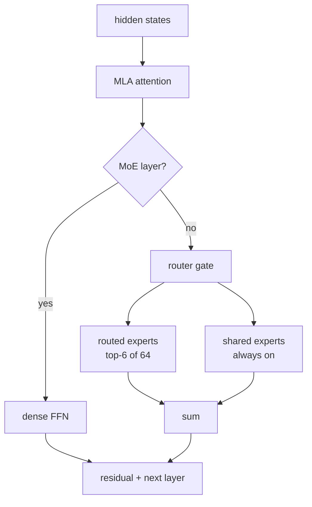

> 前两篇分别做了 Mini-SGLang 的分层 KV Cache（mini-hicache）和 MoE（mini-moe）。这一篇把两块拼起来，目标是让 DeepSeek-V2-Lite——一个 15.7B 的 MLA + MoE 模型——在一张 12GB 的 RTX 5070 上真正跑起来。
>
> **更新（09-18）**：mini-hicache 已经 merge 进这个分支，另外做了一轮优化——MLA 投影 GEMM 合并、expert 缓存的可插拔淘汰策略、一个 tvm-ffi 流同步的正确性修复，以及一次（被上游卡住的）CUDA graph 攻坚。新增了「跑通之后：三处优化和一次没做成的 CUDA graph」一节，实测数字也全部换成了新 benchmark 的分相数据。

## 为什么是 DeepSeek

Mini-SGLang 一开始只支持 Llama / Qwen 这种「标准」结构：GQA attention + dense FFN，或者 Qwen3 那种 GQA + 普通 MoE。DeepSeek 不一样，它在两个维度上都做了非常规设计：

- **MLA（Multi-head Latent Attention）**：不再缓存完整的 K/V，而是缓存一个低秩的 latent 向量。
- **细粒度 MoE**：64 个 routed experts + 2 个 shared experts，每个 token 只激活 6 个 routed。

这两件事单独看都很有意思，合在一起就是一个很实际的工程问题：**15.7B 参数的模型，怎么在 12GB 显存里跑？** 答案正好是我前几篇做的两块：

- MLA 把 KV cache 从 276 KB/token 压到 **31 KB/token（8.89x）**，腾出了放专家缓存的空间；
- MoE 的 FP8/CPU offload 让 29GB 的专家权重不必全驻显存。

所以这篇其实是 mini-mla + mini-moe 的一篇「合体」记录，外加把它们粘到 DeepSeek 结构上时踩的坑。

## MLA：KV 为什么要压

标准 MHA/GQA 给每个 token 的每个 KV head 缓存完整的 K 和 V。解码是 memory-bound 的，KV 就是主要显存开销。DeepSeek-V2 的 MLA 换了个思路：**不缓存 K/V，缓存生成 K/V 的中间 latent**。

具体来说，每个 token 每层只缓存两样东西：

- `c_KV`：一个 `kv_lora_rank = 512` 维的压缩 latent；
- `k_pe`：一个 `qk_rope_head_dim = 64` 维的、跨 head 共享的 RoPE key。

算 attention 的时候再把 latent 上投影回 K/V。为了省算力，实现上还会把上投影矩阵「吸收」进 query 和 output 投影（matrix absorption），直接在 latent 上做 attention。

对 DeepSeek-V2-Lite（16 heads、`qk_nope=128`、`v_head=128`、27 层）算笔账：

| 方案 | 每 token 每层 | BF16 每 token |
|---|---:|---:|
| MLA（`c_KV` + `k_pe`） | 512 + 64 = 576 | 31 KB |
| MHA 等价（16 × (192 K + 128 V)） | 5120 | 276 KB |

**8.89x**。放到 12GiB 的 KV 预算里，MLA 能放 41 万个 token，MHA 只能放 4.6 万个。


代价是 attention 本身的 head 维度变大了（`512+64=576`），所以 MLA 通常在 prefill 用物化 K/V 的「naive」形态、decode 用吸收后的「absorbed」形态。我这边用 FlashInfer 的 `BatchMLAPagedAttentionWrapper` 统一走 absorbed，prefill 和 decode 实测都能和参考实现对齐。

## DeepSeek 的 MoE 和 Qwen3 有什么不同

Qwen3 的 MoE 是「router + 一组 routed experts」。DeepSeek 多了两件事：

1. **shared experts**：一组**所有 token 都会走**的 dense 专家，输出直接加到 routed 输出上。DeepSeek-V2-Lite 有 2 个，intermediate size 是 `2 × 1408`。
2. **层选择**：`first_k_dense_replace = 1` 表示第 0 层是普通 dense FFN，第 1 层往后才是 MoE。

所以模型的 FFN 不能无脑套 `MoEMLP`，得按层判断，并且 MoE 层要额外算一路 shared experts。

## 整体结构

现在这个分支是三个分支拼起来的：

- `mini-mla`：MLA attention、latent KV pool、FlashInfer paged backend、`DeepseekV2ForCausalLM`；
- `mini-moe`：fused expert kernel、FP8/INT8 专家量化、Expert Parallel、CPU offload；
- `mini-hicache`：pinned host L2 + 本地文件 L3 的分层 KV（已 merge 进来；目前只支持 MHA 池，见文末）；
- `mini-deepseek`：把上面 merge，再补 DeepSeek 特有的 shared experts、层选择、权重加载。

一次 forward 的路径：



## 粘起来时踩的坑

### 1. MLA 的 RoPE 是 interleaved

DeepSeek 的参考实现用 `view_as_complex(x.reshape(..., -1, 2))` 做旋转，也就是把**相邻元素**配成一对（interleaved / GPT-J）。而 Mini-SGLang 原来调的 FlashInfer RoPE 默认 `is_neox=True`，是「前后两半配对」的 Neox 布局。这两个**不通用**：

我用一个小实验确认了 `is_neox=True` = Neox、`is_neox=False` = interleaved：

```
is_neox=True : vs half(Neox)=3.8    vs interleaved=1809.8
is_neox=False: vs half(Neox)=1806.6 vs interleaved=3.9
```

所以给 `RotaryEmbedding` 加了 `is_neox` 参数（默认 True，不动现有模型），MLA 传 `False`。另外 MLA 只对 64 维的 `q_pe`/`k_pe` 做 RoPE，不能作用在拼接后的 192 维 query 上。

### 2. FlashInfer 的 MLA 接口和想象的不一样

我一开始以为 latent 是融合成一个 `512+64=576` 维的 buffer。实际上 `BatchMLAPagedAttentionWrapper`：

- 要**分开**的 `ckv` 和 `kpe` 两个 cache；
- 输入是**吸收后**的 query（`q_abs`，维度是 `kv_lora_rank=512`），不是原始的 128 维 `q_nope`；
- 输出是 latent 的 `z`（`[tokens, heads, 512]`），caller 自己再乘 `W_UV`。

所以 `MLAKVCache` 用两个 buffer，`MLAttention` 负责吸收和反投影，backend 只负责存和算。

### 3. 权重加载的两个 DeepSeek 特有点

Mini-SGLang 的 loader 会把 `.q_proj`/`.k_proj`/`.v_proj` 合并成一个 `qkv_proj`。但 MLA 的 `q_proj` 是独立的，没有 k/v——如果不处理，它会在 merge buffer 里**永远等不到 k/v，整个权重都不会 yield**。修法是让 loader 在 MLA 模型上跳过 `.q_proj` 的合并。

另一个是 `kv_b_proj`：它是按 head 列并行的，需要加进 column-parallel 的切分列表（TP=1 时无所谓，TP>1 才对）。

## 12GB 怎么分配

跑起来的关键是把「什么放 GPU、什么放 host」分清楚：

| 部分 | 位置 | 大小 |
|---|---|---:|
| routed experts（64 × 26 层，BF16） | host（offload） | ~29 GB |
| dense 权重（MLA attention / embedding / shared experts / router） | GPU | ~2.5 GiB |
| 专家缓存（每层 8 个） | GPU | 3.35 GiB |
| MLA latent KV（92437 token） | GPU | 2.68 GiB |
| 初始化后剩余 | GPU | 5.37 GiB |

host 那 29GB 正好是 BF16 的全部 routed experts。GPU 上只保留一小撮热点专家（每层 8 个，策略可换，见下文），缺的走 pinned H2D。

## 实测（首版）

第一版在 RTX 5070（12GB）上，BF16 专家 + CPU offload：

```
pool: MLAKVCache        attn_backend: MLAttentionBackend
num_pages: 92437        load_seconds: 91.7
cold_seconds: 78.9      warm_seconds: 4.53   warm_tokens_per_second: 3.53
greedy output:
  "The capital of France is" -> " a city of culture, history, and art. ..."
  "1 + 1 ="                  -> " 2 ..."
```

**能跑，而且输出是连贯的。但也要如实说：不快。** 冷启动 79s 是把用到的专家从 host 搬上 GPU；之后每请求 4.5s / 16 token，瓶颈是 PCIe。这一版还暴露了一个测量问题：所谓「warm」其实混了三种状态——专家冷/热、前缀新/旧。下面的优化轮里 benchmark 重写成了四个相位，数字才可比。

## 跑通之后：三处优化和一次没做成的 CUDA graph

跑通只是第一步。对着 profile 和计数器又做了一轮，按收益排序记录。

### 0. 先把 benchmark 拆成四个相位

旧的 bench 只有「冷/热」两态，但影响延迟的其实有两个独立变量：**专家驻留状态**和**前缀复用状态**。新的 `bench_deepseek.py` 把请求分成：

| 相位 | 专家 | 前缀 | 度量什么 |
|---|---|---|---|
| `first_use` | 冷（含 JIT） | 新 | 最坏情况 |
| `warmup_novel_prefix` | 部分热 | 新 | 前缀不复用时的稳态 |
| `expert_warm_novel_prefix` | 热 | 新 | 纯路由局部性 |
| `same_prefix_repeat` | 热 | radix 命中 | 纯 decode 能力 |

同时每相记录引擎侧 TTFT、逐 token 间隔、专家缓存 hit/miss 计数和 H2D 字节（`FusedMoe.expert_cache_stats()` 暴露的观测接口）。后面所有对比都在这套口径下。

### 1. MLA 的三个投影合成一个 GEMM

`MLAttention` 每层开头要算两个读同一个 hidden states 的投影：query 路径（`q_proj`，3072 行）和 latent 路径（`kv_a_proj_with_mqa`，576 行）。两个 GEMM 改成一个 `[q | c_KV | k_pe]` 共 3648 行的合并 GEMM，权重加载时直接按这个布局 merge。

做之前先验证了三件事，都过了：

- 合并 GEMM 的输出切片是非连续的，但**最后一维的 view 拆分**（`[T, 3648]` → `[T, 16, 192]`）在 strided 张量上仍然合法；
- FlashInfer 的 `rmsnorm` **支持行跨步输入**（`c_kv` 切片不用 `.contiguous()`）；
- einsum 对 strided 的 `q_nope` 结果逐位一致。

所以合并是纯赚的，没有引入任何额外拷贝。实测（RTX 5070，单层投影块含 norm/切片）：

| 输入 token 数 | 拆开两个 GEMM | 合并一个 | 变化 |
|---:|---:|---:|---:|
| 1（decode） | 67.7 us | 39.8 us | **-41%** |
| 512（prefill） | 146.0 us | 159.4 us | +9% |

decode 是 launch bound，少一个 kernel + 更大的 GEMM 直接赚 41%，27 层每步省约 750us；prefill 大 M 时合并略亏（3648 不是 128 的倍数，tiling 有尾巴），但相对整层开销可以忽略。合并条件也按 TP 写清楚了：`q_proj` 是 column-parallel，只有 TP=1 能合并；`q_a_proj` 是复制的，任意 TP 都能合并。

### 2. expert 驻留：LRU 不是唯一选项

新口径下看计数器，发现一个比预期刺眼的数字：**同前缀重复请求（radix 命中、纯 decode）的专家命中率只有 ~0.50**。也就是说前缀 KV 全复用了，专家还在每步过一半的 PCIe。

原因在路由流的形状：decode 每步激活 6 个专家、缓存只有 8 个，路由又在缓慢漂移，于是「最近使用序」和「即将使用序」错开——LRU 在循环访问模式下会持续把马上要用的专家踢出去（经典 thrash）。mini-moe 那篇给 radix cache 做过一套可插拔淘汰策略，这里照方抓药给 `ExpertResidentCache` 也做了一套（`moe/expert_eviction.py`）：

| 策略 | 选择规则 |
|---|---|
| `lru`（默认，行为不变） | 最近最少路由 |
| `lfu` | 最低访问计数，recency 决胜 |
| `frequency-decay` | 指数衰减频率（60s 半衰期） |
| `lru-k` | 第 k 次访问最旧；不足 k 次的先淘汰 |

一个设计细节：**替换元数据跨淘汰保留**。纯 LFU 在淘汰时清零计数，循环流下照样抖；这里被淘汰的专家重新载入时带着历史计数，热点集合会稳定下来。`frequency-decay` 用时间衰减解决「历史热点不再热」的漂移问题。

实测（V2-Lite，BF16 offload，每层缓存 8，LRU → LFU）：

| 相位（中位数） | LRU | LFU | 变化 |
|---|---:|---:|---:|
| `same_prefix_repeat` | 3.41 s | 2.88 s | **-15%** |
| `expert_warm_novel_prefix` | 7.80 s | 6.01 s | **-23%** |
| 命中率（same_prefix） | 0.48–0.53 | 0.54–0.55 | +4~6pp |
| 每请求 H2D | 20.4–22.3 GB | 19.5–19.9 GB | ~-10% |

诚实地说：提升集中在 decode 相位；prefill 的 miss 是**容量**问题（32 token 的 prompt 每层就能路由到 30+ 个不同专家，缓存 8 个怎么都会 miss），策略救不了，那是 FP8/更大缓存/更多显存的事。

### 3. 一个没想到的发现：MLA kernel 一直在错误的流上跑

给 CUDA graph 铺路时撞出一个 eager 路径的存量问题。FlashInfer 0.6.17 的 MLA kernel 通过 **tvm-ffi** 启动，而 tvm-ffi 有自己的线程局部流，**不跟随 `torch.cuda.stream()`**：

```python
s = torch.cuda.Stream()
with torch.cuda.stream(s):
    torch.cuda.current_stream().cuda_stream  # 722260304
    tvm_ffi.get_raw_stream(...)              # 0  ← 没跟上
```

也就是说 MLA kernel 一直落在 stream 0 上，和引擎自己的 stream 之间**没有任何顺序保证**——store_mla 写完 KV、kernel 再去读，全靠 launch 延迟碰巧兜住。单卡串行负载下几乎不炸，但这是埋着的雷。修法是 plan/run 都包进 `tvm_ffi.use_torch_stream()`。

### 4. CUDA graph：配方做出来了，被 tvm-ffi 卡住

这是这轮最想做成、最终没做成的一项，但调查结论值得完整记录，因为「为什么不行」比「怎么做」信息量更大。

先说做出来的部分。MLA decode 的图捕获配方，验证到 kernel 级是**对的**：

1. 每个 batch size 一个 `use_cuda_graph=True` 的 wrapper，背后挂持久 device buffer（`qo_indptr/kv_indptr/kv_indices/kv_len_arr`）；
2. **捕获时的 plan 用 `max_seq_len`**：读了 FlashInfer 的 `mla_params.cuh`，kernel 从 device 数组动态读每请求长度和工作分配（`for work_idx in [work_indptr[b], work_indptr[b+1])`），但 **launch grid 在捕获时就烧死了**——按最坏长度规划，回放时多出来的 CTA 读到空工作段自然退出，反了就会漏算 split-KV；
3. 回放前用真实长度重新 plan，内容全走持久 buffer；
4. 传给 kernel 的所有张量（q、out）都必须**捕获前分配**——这是踩出来的：图内存池里现分配的中间张量喂给 tvm kernel，launch 会静默不被录制。

按这套配方，脱离引擎的 wrapper 级验证全过：三种序列长度 + 换 query，回放与 ground truth **逐位一致（diff=0.0）**。

然后在引擎里挂掉。挂掉的方式很有教育意义——kernel 压根没进图（回放后输出是捕获前的残留），而且**一次失败的捕获会污染整个进程**：之后连 eager 调用都只产出零。最小化复现不需要引擎，就是 wrapper + `torch.cuda.graph` 的事，属于 flashinfer 0.6.17 / tvm-ffi 这条 launch 路径与图捕获的兼容性问题。

更值得记的是调试路上踩的**三个假阳性**，每一个都让我一度以为修好了：

- **JIT 首跑零输出**：plan 之后的第一次 run 会返回近零的值，第二次才正常。早期几个「敏感性测试」其实在拿噪声比噪声；
- **同路径对照无效**：调试时用「回放后再跑一遍 eager forward」做参考——但那遍 eager 复用了和图相同的持久 buffer，等于自己比自己，diff 恒为 0；
- **没换输入的对照无效**：一个「通过了」的对照，事后发现两次回放之间根本没改输入。

教训浓缩成一句：**验证图回放，必须让「图路径」和「参考路径」在数据流上完全独立，并且每次都改变输入。**

现在的状态：引擎对 MLA 强制关 graph（带说明的 warning），配方的代码和文档留在 `docs/mla_design.md` 的 CUDA graph 一节，升级 flashinfer/tvm-ffi 之后可以直接重启。tiny 模型测试 `test_tiny_deepseek_e2e.py` 里也留了一个「请求 graph 必须被正确禁用且结果不坏」的回归。

### 5. 合并 mini-hicache

最后把 mini-hicache 也 merge 了进来，冲突 8 个文件，基本都是「两边各自新增」型：`CacheManager` 现在同时接受淘汰策略参数和全套 hicache 参数，`check_integrity` 保留了更强的一版并补上重复物理索引检查。要说明的是 **HiCache 目前仍然只支持 MHA 池**——MLA 的 latent 双 buffer 布局需要新的 page-major 传输路径（设计文档里 tracked 为 `mini-hicache-mla`），启用 hicache 时 MLA 池会被明确拒绝。这次 merge 的意义是让三条线共存，为那一步打底。

### 优化后的实测

合并 + 优化后，同一台 RTX 5070、BF16 专家 + offload、每层缓存 8、LFU：

| 相位 | 中位数 | 说明 |
|---|---:|---|
| `first_use`（含 JIT、冷专家） | ~72–87 s | 仍是冷专家 PCIe 主导 |
| `expert_warm_novel_prefix` | 6.0 s | 相比 LRU 的 7.8 s（-23%） |
| `same_prefix_repeat` | 2.9 s | 相比 LRU 的 3.4 s（-15%），≈5.5 tok/s |

结论没变：这条路径仍然是**容量 demo**，稳态瓶颈还是专家 miss 的 PCIe。但同样的硬件配置，纯靠软件把两个稳态相位各降了 15–23%，而且把「为什么慢、慢在哪一相」变成了可观测的。

## 复现

```bash
# 1. 下载模型（约 30GB）
hf download deepseek-ai/DeepSeek-V2-Lite --local-dir /home/yzd/models/DeepSeek-V2-Lite

# 2. 端到端（12GB 卡），分相计时 + 专家驻留计数
python benchmark/offline/bench_deepseek.py \
  --model /home/yzd/models/DeepSeek-V2-Lite \
  --expert-offload --expert-cache-size 8 \
  --expert-cache-eviction-policy lfu \
  --expert-quantization none

# 3. 只看 MLA 的 KV / 延迟
python benchmark/offline/bench_mla.py

# 4. 合成 tiny DeepSeek 的全引擎回归（不需要下载模型）
pytest tests/core/test_tiny_deepseek_e2e.py -q
```

代码在 `nothiny/mini-sglang` 的 `mini-deepseek` 分支（`mini-mla` + `mini-moe` + `mini-hicache` 合并，外加上述优化）。文档：`docs/mla_design.md`、`docs/deepseek_design.md`、`docs/moe_optimizations.md`、`docs/hicache_design.md`。

## 学到的

1. **MLA 的价值在长上下文和显存紧张时最明显**。8.89x 的 KV 压缩不是锦上添花，它是「12GB 卡能不能放下专家缓存」这个问题的前提。
2. **MLA 的坑集中在两处**：RoPE 的配对方式，和吸收后的大 head 维度怎么喂给 kernel。前者错了输出全废，后者决定了接口形态。这轮又加了第三处：**kernel 跑在哪个流上**——跨 runtime（torch / tvm-ffi）的流语义差异是隐形雷。
3. **MoE 的 offload 是容量优化，不是性能优化**。它让模型能装下，但代价是 PCIe 延迟；真正要快得靠命中率或量化。淘汰策略能救 decode 相位的循环抖动，救不了容量性 miss。
4. **组合比单点难**。MLA 和 MoE 各自都能对齐参考实现，但拼成 DeepSeek 时，`first_k_dense_replace`、shared experts、权重命名这些「胶水」才是让整条链路跑通的关键。
5. **测量先于优化**。把 benchmark 拆成四个相位之后，「该优化什么」自己浮出来了（同前缀命中率 0.50 这个数字比任何 profile 都直接）。
6. **验证 CUDA graph 的对照必须数据流独立**。同路径、同 buffer、没换输入的对照全是假阳性，这轮踩了三个。

后面能做的：升级 flashinfer/tvm-ffi 后重启 MLA CUDA graph（配方已就绪）、prefill 的 naive 形态（ragged，192/128）、FP8 KV cache（`run()` 的 `ckv_scale/kpe_scale` 已支持）、DeepSeek-V3 的 `noaux_tc` router，以及把 HiCache 扩展到 MLA 布局。
