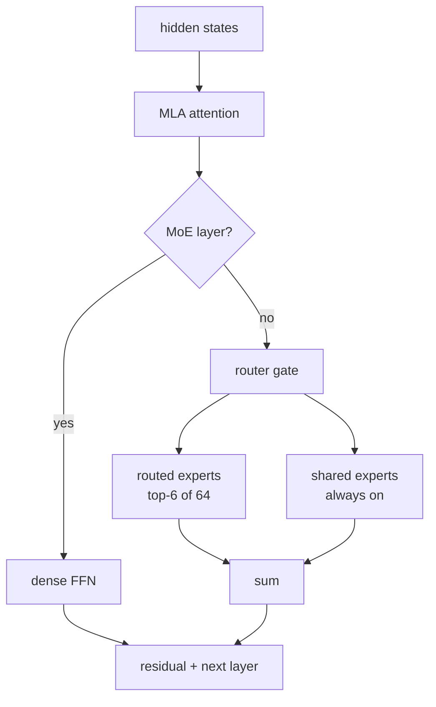

> 前两篇分别做了 Mini-SGLang 的分层 KV Cache（mini-hicache）和 MoE（mini-moe）。这一篇把两块拼起来，目标是让 DeepSeek-V2-Lite——一个 15.7B 的 MLA + MoE 模型——在一张 12GB 的 RTX 5070 上真正跑起来。

## 为什么是 DeepSeek

Mini-SGLang 一开始只支持 Llama / Qwen 这种「标准」结构：GQA attention + dense FFN，或者 Qwen3 那种 GQA + 普通 MoE。DeepSeek 不一样，它在两个维度上都做了非常规设计：

- **MLA（Multi-head Latent Attention）**：不再缓存完整的 K/V，而是缓存一个低秩的 latent 向量。
- **细粒度 MoE**：64 个 routed experts + 2 个 shared experts，每个 token 只激活 6 个 routed。

这两件事单独看都很有意思，合在一起就是一个很实际的工程问题：**15.7B 参数的模型，怎么在 12GB 显存里跑？** 答案正好是我前两篇做的两块：

- MLA 把 KV cache 从 276 KB/token 压到 **31 KB/token（8.89x）**，腾出了放专家缓存的空间；
- MoE 的 FP8/CPU offload 让 29GB 的专家权重不必全驻显存。

所以这篇其实是 mini-mla + mini-moe 的一篇「合体」记录，外加把它们粘到 DeepSeek 结构上时踩的坑。

## MLA：KV 为什么要压

标准 MHA/GQA 给每个 token 的每个 KV head 缓存完整的 K 和 V。解码是 memory-bound 的，KV 就是主要显存开销。DeepSeek-V2 的 MLA 换了个思路：**不缓存 K/V，缓存生成 K/V 的中间 latent**。

具体来说，每个 token 每层只缓存两样东西：

- `c_KV`：一个 `kv_lora_rank = 512` 维的压缩 latent；
- `k_pe`：一个 `qk_rope_head_dim = 64` 维的、跨 head 共享的 RoPE key。

算 attention 的时候再把 latent 上投影回 K/V。为了省算力，实现上还会把上投影矩阵「吸收」进 query 和 output 投影（matrix absorption），直接在 latent 上做 attention。

对 DeepSeek-V2-Lite（16 heads、`qk_nope=128`、`v_head=128`、27 层）算笔账：

| 方案 | 每 token 每层 | BF16 每 token |
|---|---:|---:|
| MLA（`c_KV` + `k_pe`） | 512 + 64 = 576 | 31 KB |
| MHA 等价（16 × (192 K + 128 V)） | 5120 | 276 KB |

**8.89x**。放到 12GiB 的 KV 预算里，MLA 能放 41 万个 token，MHA 只能放 4.6 万个。


代价是 attention 本身的 head 维度变大了（`512+64=576`），所以 MLA 通常在 prefill 用物化 K/V 的「naive」形态、decode 用吸收后的「absorbed」形态。我这边用 FlashInfer 的 `BatchMLAPagedAttentionWrapper` 统一走 absorbed，prefill 和 decode 实测都能和参考实现对齐。

## DeepSeek 的 MoE 和 Qwen3 有什么不同

Qwen3 的 MoE 是「router + 一组 routed experts」。DeepSeek 多了两件事：

1. **shared experts**：一组**所有 token 都会走**的 dense 专家，输出直接加到 routed 输出上。DeepSeek-V2-Lite 有 2 个，intermediate size 是 `2 × 1408`。
2. **层选择**：`first_k_dense_replace = 1` 表示第 0 层是普通 dense FFN，第 1 层往后才是 MoE。

所以模型的 FFN 不能无脑套 `MoEMLP`，得按层判断，并且 MoE 层要额外算一路 shared experts。

## 整体结构

三个分支拼起来是这样：

- `mini-mla`：MLA attention、latent KV pool、FlashInfer paged backend、`DeepseekV2ForCausalLM`；
- `mini-moe`：fused expert kernel、FP8/INT8 专家量化、Expert Parallel、CPU offload；
- `mini-deepseek`：把上面两个 merge，再补 DeepSeek 特有的 shared experts、层选择、权重加载。

一次 forward 的路径：



## 粘起来时踩的坑

### 1. MLA 的 RoPE 是 interleaved

DeepSeek 的参考实现用 `view_as_complex(x.reshape(..., -1, 2))` 做旋转，也就是把**相邻元素**配成一对（interleaved / GPT-J）。而 Mini-SGLang 原来调的 FlashInfer RoPE 默认 `is_neox=True`，是「前后两半配对」的 Neox 布局。这两个**不通用**：

我用一个小实验确认了 `is_neox=True` = Neox、`is_neox=False` = interleaved：

```
is_neox=True : vs half(Neox)=3.8    vs interleaved=1809.8
is_neox=False: vs half(Neox)=1806.6 vs interleaved=3.9
```

所以给 `RotaryEmbedding` 加了 `is_neox` 参数（默认 True，不动现有模型），MLA 传 `False`。另外 MLA 只对 64 维的 `q_pe`/`k_pe` 做 RoPE，不能作用在拼接后的 192 维 query 上。

### 2. FlashInfer 的 MLA 接口和想象的不一样

我一开始以为 latent 是融合成一个 `512+64=576` 维的 buffer。实际上 `BatchMLAPagedAttentionWrapper`：

- 要**分开**的 `ckv` 和 `kpe` 两个 cache；
- 输入是**吸收后**的 query（`q_abs`，维度是 `kv_lora_rank=512`），不是原始的 128 维 `q_nope`；
- 输出是 latent 的 `z`（`[tokens, heads, 512]`），caller 自己再乘 `W_UV`。

所以 `MLAKVCache` 用两个 buffer，`MLAttention` 负责吸收和反投影，backend 只负责存和算。

### 3. 权重加载的两个 DeepSeek 特有点

Mini-SGLang 的 loader 会把 `.q_proj`/`.k_proj`/`.v_proj` 合并成一个 `qkv_proj`。但 MLA 的 `q_proj` 是独立的，没有 k/v——如果不处理，它会在 merge buffer 里**永远等不到 k/v，整个权重都不会 yield**。修法是让 loader 在 MLA 模型上跳过 `.q_proj` 的合并。

另一个是 `kv_b_proj`：它是按 head 列并行的，需要加进 column-parallel 的切分列表（TP=1 时无所谓，TP>1 才对）。

## 12GB 怎么分配

跑起来的关键是把「什么放 GPU、什么放 host」分清楚：

| 部分 | 位置 | 大小 |
|---|---|---:|
| routed experts（64 × 26 层，BF16） | host（offload） | ~29 GB |
| dense 权重（MLA attention / embedding / shared experts / router） | GPU | ~2.5 GiB |
| 专家缓存（每层 8 个） | GPU | 3.35 GiB |
| MLA latent KV（92437 token） | GPU | 2.68 GiB |
| 初始化后剩余 | GPU | 5.37 GiB |

host 那 29GB 正好是 BF16 的全部 routed experts。GPU 上只保留一小撮热点专家（每层 8 个 LRU），缺的走 pinned H2D。

## 实测

在 RTX 5070（12GB）上，BF16 专家 + CPU offload：

```
pool: MLAKVCache        attn_backend: MLAttentionBackend
num_pages: 92437        load_seconds: 91.7
cold_seconds: 78.9      warm_seconds: 4.53   warm_tokens_per_second: 3.53
greedy output:
  "The capital of France is" -> " a city of culture, history, and art. ..."
  "1 + 1 ="                  -> " 2 ..."
```

**能跑，而且输出是连贯的。** 但也要如实说：**不快**。

- 第一次请求要 79s，因为要把用到的专家从 host 搬上 GPU；之后的请求 4.5s / 16 token。
- 瓶颈是 PCIe：每层缓存只有 8 个专家，随机路由下基本每个 token 都 miss，每 token 大约 2.7GB H2D。
- 关掉 CUDA graph（MLA 目前没做 graph），decode 还有一部分 CPU/launch 开销。

换句话说，这是一个**容量 demo**：证明了「MLA + MoE + offload」这套编排在消费级 12GB 卡上是成立的。要更快，要么 `--expert-quantization fp8` 把 host/H2D 减半，要么把专家缓存调大（会挤 KV），要么让工作负载本身有路由局部性。

## 复现

```bash
# 1. 下载模型（约 30GB）
hf download deepseek-ai/DeepSeek-V2-Lite --local-dir /home/yzd/models/DeepSeek-V2-Lite

# 2. 端到端跑（12GB 卡）
python benchmark/offline/bench_deepseek.py \
  --model /home/yzd/models/DeepSeek-V2-Lite \
  --expert-offload --expert-cache-size 8 --expert-quantization none

# 3. 只看 MLA 的 KV / 延迟
python benchmark/offline/bench_mla.py
```

代码在 `nothiny/mini-sglang` 的 `mini-deepseek` 分支（由 `mini-mla` + `mini-moe` 合并而来）。文档：`docs/mla_design.md`、`docs/deepseek_design.md`、`docs/moe_optimizations.md`。

## 学到的

1. **MLA 的价值在长上下文和显存紧张时最明显**。8.89x 的 KV 压缩不是锦上添花，它是「12GB 卡能不能放下专家缓存」这个问题的前提。
2. **MLA 的坑集中在两处**：RoPE 的配对方式，和吸收后的大 head 维度怎么喂给 kernel。前者错了输出全废，后者决定了接口形态。
3. **MoE 的 offload 是容量优化，不是性能优化**。它让模型能装下，但代价是 PCIe 延迟；真正要快得靠命中率或量化。
4. **组合比单点难**。MLA 和 MoE 各自都能对齐参考实现，但拼成 DeepSeek 时，`first_k_dense_replace`、shared experts、权重命名这些「胶水」才是让整条链路跑通的关键。

后面能做的：MLA 的 CUDA graph 与 TP 分片、FP8 KV、以及和 `transformers` 的全模型 bit-exact 对比。
